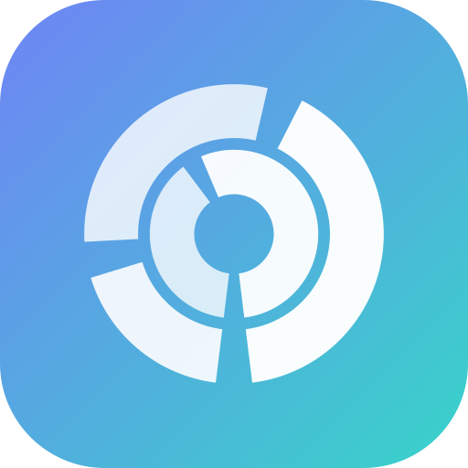
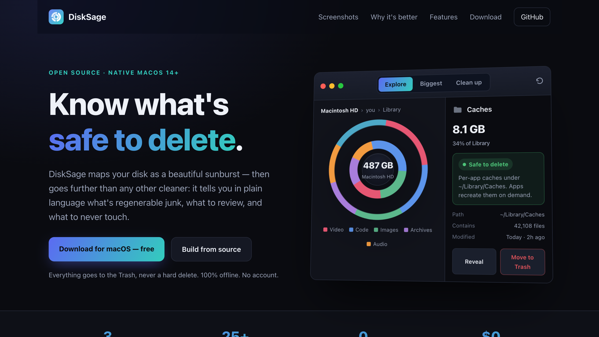
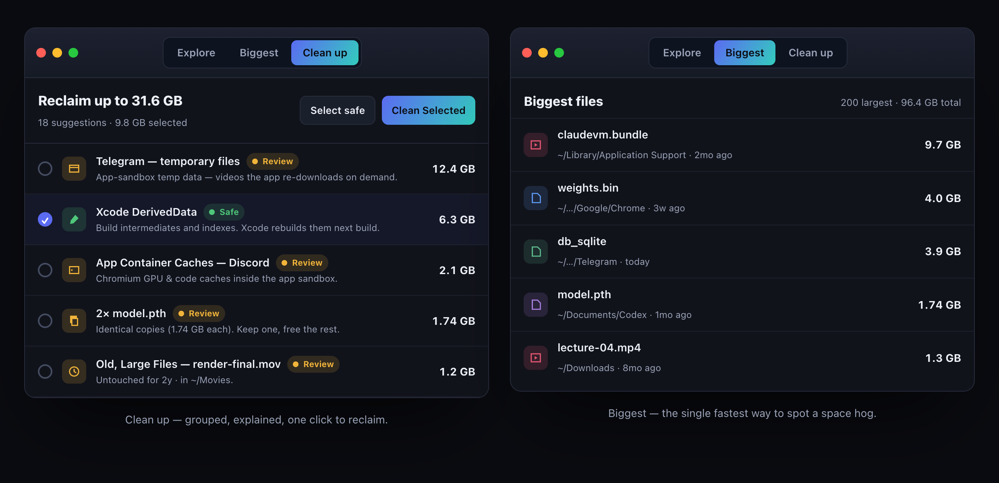

<div align="center">



# DiskSage

**The open-source disk cleaner that knows what's safe to delete.**

A native macOS app in the spirit of DaisyDisk — a beautiful sunburst map of
your disk — plus a built-in advisor that tells you, in plain language, what's
*safe junk*, what to *review first*, and what to *never touch*.

[**Download for macOS**](https://github.com/stealthdev-labs/disksage/releases/latest) · [Live demo](https://stealthdev-labs.github.io/disksage/) · [Features](#features) · [How the advisor works](#the-advisor-not-a-cloud-ai) · [Contributing](CONTRIBUTING.md)

[](https://github.com/stealthdev-labs/disksage/actions/workflows/ci.yml)


<br>



</div>

---

## What is DiskSage?

Most disk cleaners either show you a pretty chart **or** delete things for you.
DiskSage does both, and adds the part that actually matters: **judgement.**

Every folder it finds is rated with one of three verdicts:

| Verdict | Meaning |
|--------|---------|
| 🟢 **Safe to delete** | Regenerable junk — caches, build artifacts, logs. Apps rebuild it. |
| 🟡 **Review first** | Deletable, but may hold real data (`node_modules`, old iOS backups, Docker). |
| 🔴 **Keep** | System files, app bundles, keychains, your own documents. DiskSage will never suggest these. |

## Screenshots

Three views, one job — explore where space went, spot your biggest files, and
clean up with confidence:

<div align="center">

</div>

Everything DiskSage removes goes to the **Trash**, never a hard delete — so a
mistake is always one ⌘Z away.

## Features

- **Sunburst disk map** — an interactive radial treemap. Click to drill in,
  click the center to go back. Color by file type or by delete-safety.
- **The advisor** — 25+ curated cleanup categories (Xcode DerivedData, Homebrew,
  npm/yarn/pnpm, pip, Gradle, Cargo, Go, Docker, browser caches, crash reports,
  old Downloads, stale `.DS_Store`, and more), each with a plain-language
  explanation of *what it is and why it's safe*.
- **One-click cleanup** — select all the Safe items, review the rest, reclaim
  space. Live tree updates, no full rescan needed.
- **Scheduled auto-clean** *(Pro)* — hands-off sweeps of regenerable junk on a
  schedule. Only ever touches items rated **Safe**, always to the Trash.
- **100% local & private** — no network calls, no telemetry, no account. The
  "AI" is a deterministic rules engine that ships in the binary.

## The advisor: not a cloud AI

DiskSage's recommendations come from a **local rules engine**, not a large
language model or a remote service. It's curated knowledge of the macOS
filesystem encoded as path rules plus a few heuristics
([`SafetyEngine.swift`](Sources/DiskSage/Core/SafetyEngine.swift)).

Why this matters:

- **Deterministic** — the same folder always gets the same verdict. No surprises.
- **Auditable** — every rule is plain Swift you can read and challenge. The
  category explanations in [`Categories.swift`](Sources/DiskSage/Models/Categories.swift)
  *are* the advice.
- **Offline & private** — your filenames never leave your Mac.

If you think a verdict is wrong, that's a one-line PR — see
[CONTRIBUTING.md](CONTRIBUTING.md).

## Requirements

- macOS **14 (Sonoma)** or later
- **Xcode Command Line Tools** (full Xcode is *not* required):
  ```sh
  xcode-select --install
  ```

## Download

Grab the latest prebuilt **DiskSage.app** from the
[Releases page](https://github.com/stealthdev-labs/disksage/releases/latest) —
free, no account. It's ad-hoc-signed, so on first launch **right-click → Open**
(or allow it under System Settings → Privacy & Security).

## Build from source

DiskSage is a Swift Package — no `.xcodeproj`, no full Xcode needed.

```sh
git clone https://github.com/stealthdev-labs/disksage.git
cd disksage

# Run it directly:
swift run

# …or assemble a double-clickable DiskSage.app in ./dist:
Scripts/bundle.sh
open dist/DiskSage.app
```

> On first launch the app is unsigned / ad-hoc-signed. macOS Gatekeeper may ask
> you to confirm: **right-click the app → Open**, or allow it under
> **System Settings → Privacy & Security**.

### Full Disk Access

To scan protected locations (and to clean everything it finds), grant DiskSage
**Full Disk Access**: System Settings → Privacy & Security → Full Disk Access →
add `DiskSage.app`. Without it, DiskSage still works but some folders read as
empty or can't be cleaned.

## Running the tests

```sh
Scripts/test.sh
```

The suite uses Swift Testing. The script auto-discovers the framework paths so
it works with Command Line Tools alone (plain `swift test` needs full Xcode for
the test runtime).

## Free & open source · support

DiskSage is **free** and MIT-licensed — the *entire* app, including auto-clean.
Nothing is crippled, hidden, or paywalled. Download it from
[Releases](https://github.com/stealthdev-labs/disksage/releases/latest) or build
it yourself.

"Pro" (auto-clean) unlocks instantly: **Settings → License → *Use source-build
key***. The license check is a deliberately simple offline stub
([`LicenseManager.swift`](Sources/DiskSage/Core/LicenseManager.swift)) — open-core,
not DRM.

## Support

If DiskSage reclaimed some space and you'd like to say thanks, donations are
welcome but never required. They simply fund development.

- **Boosty:** <https://boosty.to/opensoursedisk>
- **Bitcoin (BTC):** `14HunJ1WC3e1eBxqDZacsAA5ddeQxSvfWW`
- **Ethereum (ERC-20):** `0x0ac4caf5b3f0460fbedeb15b61435fd7417f1598`
- **USDT (TRC-20 / TRON):** `TYWkDcERszTCfYZjeScKXPmn2LrDugdMmc`
- **TON:** `UQDfZ-EU_WPNI5Be0o8JqfBIfseXIRaMxk8QxLYAXjRsfcmf`

Nothing is gated behind donations — the entire app is free.

## How auto-clean works (Pro)

When enabled, DiskSage runs a sweep on launch and every 6 hours while it's open.
It is intentionally conservative:

- It only looks in regenerable-junk roots: `~/Library/Caches`, `~/Library/Logs`,
  and `~/Library/Developer/Xcode/DerivedData`.
- It only removes items the advisor rates **Safe** *and* that are flagged
  auto-clean-eligible.
- Everything goes to the **Trash**. Nothing is ever hard-deleted.

You can also hit **Run now** in Settings → Auto-clean at any time.

## Project layout

```
Sources/DiskSage/
  App/        App entry point, global state, license, outbound links
  Core/       Scanner, SafetyEngine (the advisor), Cleaner, formatting
  Models/     FileNode tree, FileKind, SafetyLevel, CleanupCategory
  Views/      SwiftUI: sunburst, explore, cleanup, inspector, settings
Scripts/      bundle.sh (build .app), make_icon.swift, test.sh
Tests/        Swift Testing suite for the engine, license, formatting
docs/         Marketing landing page (static HTML/CSS) — served via GitHub Pages
```

## Privacy

DiskSage makes **no network connections** of its own. It does not collect
analytics. The only outbound actions are ones you trigger — opening the website
or the purchase page in your browser. Your filenames and disk contents never
leave your Mac.

## Contributing

Issues and PRs welcome — adding cleanup categories or correcting a safety
verdict is a great first contribution. See [CONTRIBUTING.md](CONTRIBUTING.md).

## License

[MIT](LICENSE) © DiskSage contributors.
